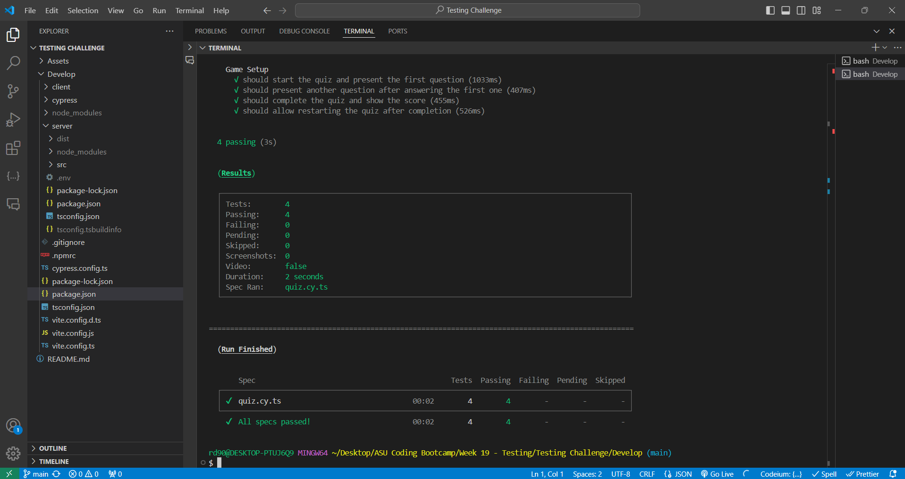

[](https://opensource.org/licenses/MIT)

# Tech Quiz Test Suite

## Description

The Tech Quiz Test Suite enhances a MERN stack quiz application by integrating Cypress for comprehensive testing. The app allows users to take a random tech quiz and view their score upon completion. This project focuses on automating component and end-to-end tests, ensuring the quiz functions correctly, from starting the quiz to viewing the final score. By building this project, I aimed to gain experience in using Cypress to improve the reliability of web applications, highlighting the importance of automated testing in maintaining robust, user-friendly software.

Walkthrough Video: https://drive.google.com/file/d/1lvXzE2VE-07dzMOGqFrsXzVidU2-gZkx/view?usp=sharing

## Table of Contents

- [Installation](#installation)
- [Usage](#usage)
- [License](#license)
- [Contributing](#contributing)
- [Questions](#questions)

## Installation

1. **Clone the repository**

   Start by cloning the repository to your local machine using the following command:

   ```bash
   git clone https://github.com/RoryDowse/tech-quiz-test-suite.git
   ```

2. **Navigate to the project directory**

   Move into the directory of the project:

   ```bash
   cd your-project-repo
   ```

3. **Install dependencies**

   ```bash
   npm install
   ```

4. **Build the project**

   ```bash
   npm run build
   ```

5. **Seed the database**

   ```bash
   npm run seed
   ```

6. **Run the Application Locally**

   ```bash
   npm run start:dev
   ```

7. **Run Cypress Tests**

   Open a new CLI window with the local application still running

   ```bash
   npm run cypress
   ```

8. **Run CLI Tests**

   Run tests from the new CLI window

   ```bash
   npm run test
   ```

## Usage

### 1. Run Component Tests in Cypress

- In Cypress, select "Component Testing"
- Select the browser in which you want to run the tests
- Select the component you wish to test

### 2. Run E2E Tests in Cypress

- In Cypress, select "E2E Testing"
- Select the browser in which you want to run the tests
- Select the E2E test you wish to run

### 3. Run Tests in the CLI

- Run "npm run test" in a new CLI window with the local server



## License

This project is licensed under the MIT license.

## Contributing

### Collaborators

Special thanks to the following collaborators who contributed to this project:

- **Charles Puente**

### Third-Party Assets

This project also makes use of the following third-party assets and libraries:

- **[Cypress](https://www.apollographql.com/docs/apollo-server/)** – A testing framework used for both component and end-to-end testing to ensure the reliability of the application's components and overall functionality.
- **[MongoDB Atlas](https://www.mongodb.com/cloud/atlas)** – A NoSQL database used to store quiz data, including questions, user responses, and scores.

## Questions

Please visit my GitHub profile: https://github.com/RoryDowse.<br>
For additional questions, please contact me at: rorydowse@hotmail.com.
